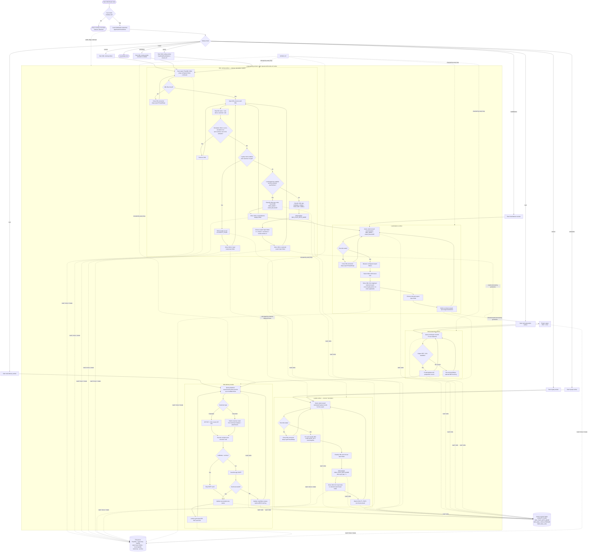

# BDH — full project flowchart

This is one end-to-end view of the active Java application. Solid arrows show
the path a file takes; dashed arrows show shared control/configuration.
`[DB]` means the Oracle support tables accessed through `DBProcess` and
`BLHelper`. `alive.ctrl` is the process stop signal.

How to read it:

1. Normal XML files go straight from `TmpXML` to the appropriate export input
   folder. Oversized files take the load-balancing path. Loyal files pause in
   the loyalty path until calculation is complete.
2. The export system (outside this source repository) consumes its input and
   produces PDF/CSV output. That output enters the mail-preparation and
   mail-delivery stages when the XML type is email-capable.
3. All workers use the same database records to coordinate progress. Removing
   `ctrl/alive.ctrl` cleanly ends their loops.

Primary code entry points: `XMLRouter` → `XMLThreadHandler` →
`XMLFileRouter`. `BLHelper` holds routing and SQL helper logic, `DBProcess`
executes database operations, `FileProcessor` runs filesystem commands, and
`LoadBalancer` selects the least-loaded export folder.
