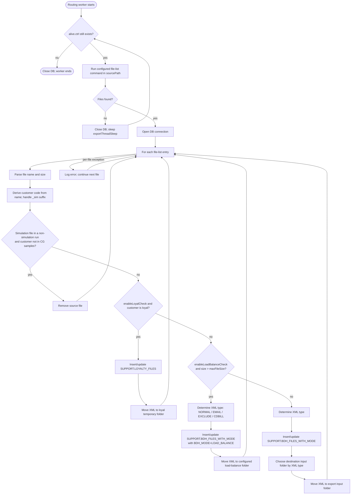
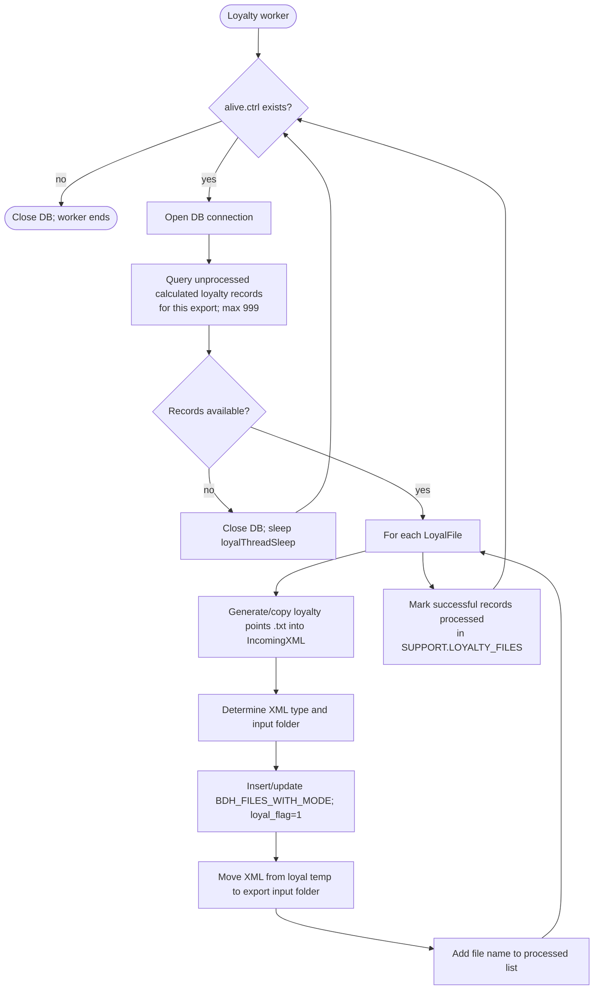
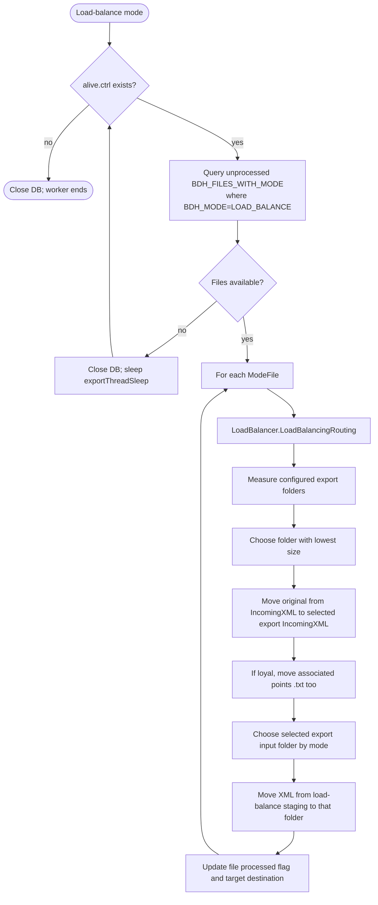
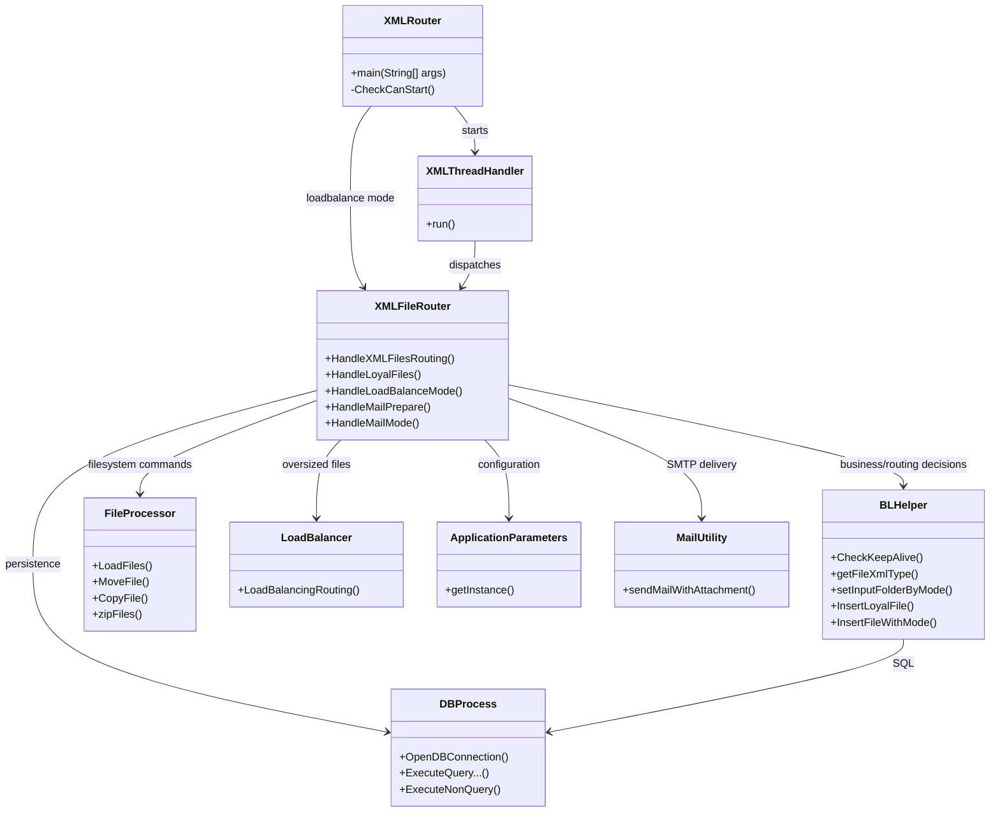

# BDH process and code flow

This chart documents the executable flow in the Java sources under
`src/eg/com/etisalat/itbilling`.  It is based on the currently active code;
large blocks labelled **legacy** in the source are intentionally excluded.

## 1. Application entry and worker topology

```mermaid
flowchart TD
    A([Start: XMLRouter.main(args)]) --> B{Create ctrl/alive.ctrl?}
    B -- already exists --> B1[Stop: another/unclean instance suspected]
    B -- created --> C[Read startup mode and ApplicationParameters]
    C --> D{mode}

    D -- normal --> N1[Start routing worker: type 2]
    D -- normal --> N2[Start loyalty worker: type 1]
    D -- simulation --> S1[Start routing worker: type 2; simulation=true]
    D -- simulation --> S2[Start loyalty worker: type 1]
    D -- ignore --> I1[Start routing worker: type 2; checks disabled]
    D -- mail --> M1[Start mail-delivery worker: type 4]
    D -- mail --> M2[Start mail-preparation worker: type 3]
    D -- loadbalance --> L1[Run load-balance handler]
    D -- other --> E[Log startup error; remove alive file]

    N1 & N2 & S1 & S2 & I1 & M1 & M2 --> T[XMLThreadHandler.run]
    T --> U[Create XMLFileRouter]
    U --> V{threadType}
    V -- 1 --> V1[HandleLoyalFiles]
    V -- 2 --> V2[HandleXMLFilesRouting]
    V -- 3 --> V3[HandleMailPrepare]
    V -- 4 --> V4[HandleMailMode]
```

`normal` enables the loyalty, mail, and load-balance flags from properties.
`ignore` builds the router with all three checks forced off.  The current
routing path does not run the old direct corporate-mail branch; email is
instead handled by the dedicated mail workers after files are produced.

## 2. Incoming XML routing worker

Entry: `XMLFileRouter.HandleXMLFilesRouting(sourcePath, destPath, isSimulation)`.



Input-folder mapping is implemented by `BLHelper.setInputFolderByMode`:

| XML type | Destination property |
| --- | --- |
| `EMAIL`, `CDBILL_EMAIL` | `emailInFolder` |
| `EXCLUDE` | `excludeInFolder` |
| `EMAIL_EXCLUDE` | `emailExcludeInFolder` |
| `NORMAL`, `CDBILL`, other | `inFolder` |

## 3. Loyalty worker

Entry: `XMLFileRouter.HandleLoyalFiles()`; only launched for `normal` and
`simulation` startup modes.



The worker waits for the database calculation state (`CALCULATED_FLAG = 2`)
before releasing a loyalty XML into the export pipeline.

## 4. Load-balance worker

Entry: `XMLFileRouter.HandleLoadBalanceMode(mainPath, lbExports)`.



## 5. Email pipeline

The `mail` startup mode launches both stages concurrently.  Their shared
state is in `SUPPORT.BDH_FILES_WITH_MODE` and mail-preparation tables.

```mermaid
flowchart LR
    A[Export output: PDF/CSV] --> B[Mail prepare worker\nHandleMailPrepare]
    B --> C[Find eligible email-type records\nnot yet prepared]
    C --> D[Locate expected output files]
    D --> E[Create preparation/status records\nor register retry/error]
    E --> F[Mail delivery worker\nHandleMailMode]
    F --> G[Find prepared, unprocessed records\nlimited by mailBatchSize]
    G --> H{Customer type}
    H -- Corporate --> I[ZIP PDF + CSV]
    H -- Consumer --> J[Build consumer mail with attachments/template]
    I --> K[Check attachment size]
    K --> L[Resolve recipient; send unless archive mode]
    J --> L
    L --> M[Update mail success/process status; optional mail log]
    M --> N[Archive ZIP/PDF/CSV where applicable]
    L -->|failure| O[Update failure/retry status; optional mail log]
```



## 6. Code-component map



## Operational control and error behavior

- Every long-running handler tests for `ctrl/alive.ctrl` via
  `BLHelper.CheckKeepAlive`; removing that file is the intended stop signal.
- Empty queues close the database connection and sleep for their configured
  interval; a populated queue is processed continuously.
- Per-file errors are logged and normally allow the loop to continue. An
  unhandled worker-level error ends that worker and is printed by
  `XMLThreadHandler`.
- Filesystem actions are shell commands (`mv`, `cp`, `rm`, configured finder
  commands) wrapped by `FileProcessor`; database writes are performed through
  `DBProcess` and `BLHelper`.
